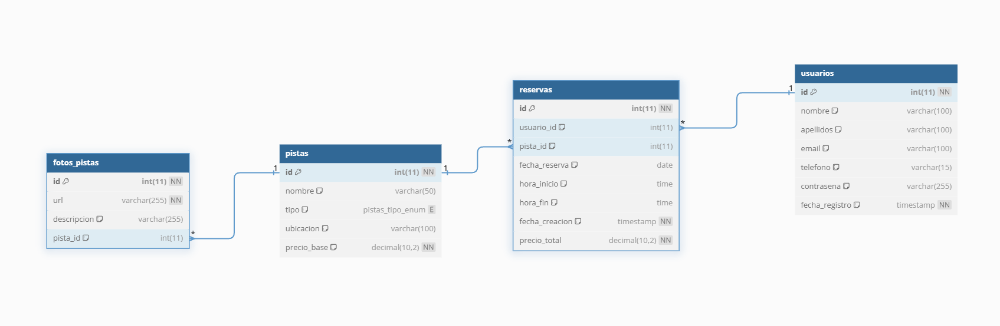
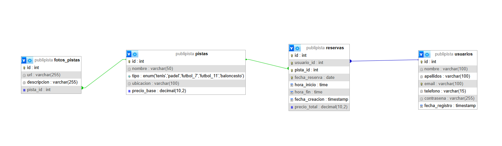

# PUBLIPISTA


<h3>CFGS Desarrollo de Aplicaciones Web (DAW)</h3>

<h3><u>Centro Educativo:</u> IES Suárez de Figueroa</h3>


**Autor del proyecto:** Ismael Sierra Vega

**Tutor del proyecto:** Israel Caldito Carrasco

**Fecha de presentación:** 12/2024

**Repositorio:** [Github](https://github.com/isierrav02/WEB)

<hr>

## Índice

1. [Introducción](#1-introducción)
2. [Objetivo del proyecto](#2-objetivo-del-proyecto)
3. [Justificación del proyecto](#3-justificación-del-proyecto)
   - [Análisis del mercado](#31-análisis-del-mercado)
   - [Vinculación de contenidos vistos en el ciclo formativo](#32-vinculación-de-contenidos-vistos-en-el-ciclo-formativo)
4. [Recursos utilizados](#4-recursos-utilizados)
   - [Entornos de desarrollo](#41-entornos-de-desarrollo)
   - [Lenguajes de programación](#42-lenguajes-de-programación)
   - [Utilidades](#43-utilidades)
5. [Tecnologías de desarrollo](#5-tecnologías-de-desarrollo)
6. [Diseño del proyecto](#6-diseño-del-proyecto)
   - [Diseño de la base de datos](#61-diseño-de-la-base-de-datos)
     - Diagrama E/R
     - Modelo relacional
   - [Carga de datos inicial](#62-carga-de-datos-inicial)
   - [Usuarios creados para pruebas](#63-usuarios-creados-para-pruebas)
7. [Lógica/codificación del proyecto](#7-lógicacodificación-del-proyecto)
   - [Principales procesos](#71-principales-procesos)
   - [Aspectos relevantes de la implementación](#72-aspectos-relevantes-de-la-implementación)
     - Validación de datos
     - Control de accesos
     - Sistemas de carpetas
8. [Conclusiones y aspectos a mejorar](#8-conclusiones-y-aspectos-a-mejorar)
9. [Bibliografía](#9-bibliografía)

<hr>

### 1. Introducción

En la actualidad, el deporte es algo fundamental en nuestras vidas y muy importante para nuestra salud, por ello este trabajo de fin de grado (TFG) llamado Publipista se centra en el diseño y desarrollo de una página web para aquellas personas interesadas en reservar una pista deportiva para la práctica del deporte en su localidad natal, con un pequeño giño por mi parte hacia mi pueblo, Puebla del Prior, usando su escudo y alguna red social para intentar hacer la web lo más realista posible.

### 2. Objetivo del proyecto

El objetivo principal de este proyecto es el de proporcionar a aquellas personas que buscan echar un ratito haciendo deporte la posibilidad de poder reservar una pista deportiva en su pueblo/ciudad.  
La finalidad del proyecto es que las personas puedan reservar fácilmente una pista deportiva para su uso.

### 3. Justificación del proyecto

#### 3.1. Análisis del mercado

El mercado de aplicaciones de gestión de reservas deportivas está en expansión, impulsado por la digitalización de servicios en todos los sectores. La mayoría de los sistemas de reservas de pistas deportivas disponibles se enfocan en ofrecer opciones de reserva para grandes instalaciones o cadenas de gimnasios, dejando de lado a instalaciones deportivas locales o de menor tamaño, que no siempre cuentan con herramientas personalizadas para la gestión de sus reservas.  
Publipista se posiciona como una solución ideal para este segmento de mercado, proporcionando a los usuarios la posibilidad de acceder fácilmente a reservas en instalaciones locales y optimizando la gestión para los administradores. La simplicidad de uso y la implementación de características esenciales, como el sistema de confirmación de reserva mediante correo electrónico, hacen que esta aplicación se adapte tanto a las necesidades de los usuarios finales como a las de los administradores de pistas deportivas en pequeñas comunidades o municipios.

#### 3.2. Vinculación de contenidos vistos en el ciclo formativo

- **Desarrollo web y bases de datos:** Se ha implementado un sistema de bases de datos relacional que permite gestionar eficientemente usuarios, reservas, y pistas deportivas, vinculando cada uno de estos elementos.

- **Validación y control de accesos:** La aplicación requiere la implementación de medidas de seguridad que incluyen la autenticación de usuarios y la validación de datos.

- **Sistemas de notificación:** La confirmación de reservas mediante correo electrónico se implementa con el uso de bibliotecas de PHP para el envío automatizado de emails.

- **Organización y estructuración del proyecto:** Se ha estructurado el proyecto en carpetas específicas para HTML, PHP y otros recursos, siguiendo buenas prácticas de organización de proyectos y facilitando el mantenimiento y la escalabilidad de la aplicación.

### 4. Recursos utilizados

Para el desarrollo de este proyecto “Publipista”, se han utilizado las tecnologías aprendidas durante el módulo de Desarrollo de Aplicaciones Web, en el que se han aprendido diversas tecnologías relacionadas con el desarrollo web.

#### 4.1. Entornos de desarrollo

- **Visual Studio Code:** Es una plataforma de lanzamiento creativa que podemos utilizar para editar, depurar, compilar código... Pero sobretodo para finalmente probar tu aplicación.

- **MySQL Workbench (o phpmyadmin):** es una herramienta visual de diseño de bases de datos que integra desarrollo de software, administración de bases de datos, diseño de bases de datos, gestión y mantenimiento para el sistema de base de datos MySQL.

#### 4.2. Lenguajes de programación

- **HTML y CSS:** HTML es el lenguaje de marcado con el que rodeas contenido, para que los navegadores sepan acerca de los encabezados, listas...  
  CSS es el lenguaje de hoja de estilos con el cual das color, cambias tamaños, fuentes y demás.
- **JavaScript:** Este lenguaje de programación dirigido al Front-End, se ha utilizado en este proyecto para mostrar y ocultar distintas secciones de la página web.

- **PHP:** Está enfocado principalmente a la programación de scripts del lado del servidor, por lo que se puede hacer cualquier cosa como generar páginas con contenidos dinámicos, o enviar y recibir cookies.

- **SQL:** Se utiliza para interactuar con la base de datos, para trabajar con conjuntos de datos y las relaciones entre ellos.

#### 4.3. Utilidades

- **Git:** Utilizado para el control de versiones, permitiendo el seguimiento de cambios de cogido y versiones de este.

### 5. Tecnologías de desarrollo

#### 5.1. Frontend

- **HTML, CSS, Bootstrap y JavaScript:** HTML utilizado para la estructura de la página web, CSS y Bootstrap para dar estilo a la página, y JavaScript para la funcionalidad dinámica de la página.

#### 5.2. Backend

- **PHP:** Utilizado para acceder, insertar,mostrar, eliminar en la base de datos, donde tenemos todos los datos necesarios para la página.

#### 5.3. Base de Datos

- **MySQL:** Lenguaje utilizado para hacer consultas en la base de datos.

### 6. Diseño del proyecto

#### 6.1. Diseño de la base de datos

- `Diagrama E/R:`



- `Modelo Relacional:`



#### 6.2. Carga de datos inicial

La carga de datos incial insertará los datos que tengo exportados en un archivo .sql que contiene información sobre los usuarios, pistas, reservas y fotos de las pistas deportivas.

Archivo en concreto: **[publipista.sql](../mysql/publipista.sql)**.

#### 6.3. Usuarios creados para pruebas

He creado 2 usuarios para comprobar el funcionamiento de los correos automatizados, y para comprobar que no se pueda reservar una pista que ya otra persona tiene reservada o que una misma persona no pueda reservar dos pistas al mismo tiempo (que ambas reservas coincidan en fecha y hora):

- Gmail:  
  Usuario: `isierrav02@educarex.es`  
  Contraseña: `hola123`
- Gmail:  
  Usuario: `pavonvallefernando@gmail.com`  
  Contraseña: `pavonvalle`

### 7. Lógica/codificación del proyecto

#### 7.1. Principales procesos

- **Inicio de sesión**: Si no estás registrado en la base de datos (lo que se comprueba internamente), podrás ver las pistas a reservar pero no hacer reservas.

- **Registro de usuarios nuevos**: Los usuarios se registran a través de un formulario, en el cual indican 4 datos obligatorios (nombre, apellidos, correo electrónico, teléfono y contraseña) que se guardan tanto en la base de datos como en [usuarios.txt](../app/usuarios.txt).

- **Página de información de las pistas**: Esta página muestra las pistas a reservar en una pequeña imagen y con su información al lado, más un botón que te lleva a otra página donde se centra exclusivamente en esa pista para darte su información y tener su foto en grande (las ubicaciones son inventadas, los precios puestos al azar y las imágenes sacadas de [freepik](https://www.freepik.es/)).

- **Página de reservas de pistas**: Esta página muestra en tarjetas las 8 pistas disponibles, apareciendo tanto la imagen como el precio/hora de reserva de cada pista.  
  Si pinchamos en cualquier tarjeta, se abre un modal para la reserva, donde te pide fecha de reserva (nunca podrá ser anterior a la fecha actual) y hora de inicio y de final de la reserva (deberá ser mínimo una hora y en intervalos de 30 minutos).  
  ⚠️ Al hacer la reserva, se envía un correo automáticamente al usuario con la confirmación de su reserva.

- **Página de las reservas**: Esta página muestra a cada usuario sus reservas, tanto el nombre de la pista, la fecha, hora de inicio, hora de fin y precio final. Además, el usuario tiene la opción de editar la reserva o de eliminarla.

- **Páginas del footer relacionadas con políticas**: Se han creado 3 páginas básicas que están en el footer, que son la política de privacidad, la política de cookies y la página de términos y concidiones. Son páginas irrelevantes pero se han creado con la intención de dar un poco más de realismo a la web.

#### 7.2. Aspectos relevantes de la implementación

- `Validación de datos`
  - **Validación de formularios**: Se incorporan validaciones en los formularios de entrada de datos para saber con exactitud que los datos introducidos respetan las reglas impuestas y estén correctos.
  - **Validación en el servidor**: Después de la validación anterior en los formularios, se realiza una validación de servidor para proteger los datos y su integridad.
- `Control de accesos`
  - **Rol y permisos**: Nos aseguramos que una persona que no inicia sesión no pueda acceder a la funcionalidad de la aplicación.
  - **Autenticación**: Mediante el formulario de login en el que preguntamos gmail y contraseña, nos aseguramos de que el usuario esté en el sistema y pueda acceder a la aplicación con sus correspondientes permisos.
- `Sistemas de carpetas`

  ```
  WEB
  ├───app
  │   ├───css
  │   ├───html
  │   ├───img
  │   ├───jquery
  │   ├───js
  │   ├───php
  │   └───phpMailer
  ├───docker
  │   ├───nginx
  │   │   ├───config
  │   │   └───snippets
  │   ├───php
  ├───docs
  │   └───img
  └───mysql
  ```

  - **app**
    - **css**: Contiene los estilos asociados a la aplicación.
    - **html**: Contiene las páginas del footer.
    - **img**: Contiene las imágenes de la aplicación.
    - **js**: Contiene los archivos Javascript para la aplicación.
    - **php**: Contiene las diferentes páginas por donde se podrá navegar en la aplicacion.
    - **phpMailer**: Biblioteca necesaria para realizar los envíos de correo automatizados.
  - **docker**: Carpeta y subcarpetas necesarias para el docker (contenedor e imágenes).
  - **docs**: Carpeta con este documento y con el manual de usuario (documentación del proyecto).
  - **mysql**: Carpeta con el fichero .sql de la base de datos.

### 8. Conclusiones y aspectos a mejorar

Ha sido un proyecto duro y difícil de desarrollar, debido al poco tiempo que se dispone para hacerlo en periodo de prácticas y a las complicaciones que se van presentando al mismo tiempo.  
El proyecto podría ser bastante más completo con un poco más de tiempo, ya que no me ha dado tiempo a realizar algunas cosas que tenía pensadas implementar en el proyecto, como por ejemplo el usuario `admin` al loguearse no vea lo mismo que el resto de usuarios, sino todas las reservas de todos los usuarios, o que los usuarios tengan la opción de ver sus reservas anteriores, y si haces alguna reserva de manera usual tener un botón como para repetirla. También mi intención era que aparte de recibir un correo automatizado al realizar una reserva, que te llegue un mensaje al teléfono, pero por falta de tiempo y de no saber cómo hacerlo no he podido implementarlo.

### 9. Bibliografía

- [Bootstrap](https://getbootstrap.com/docs/5.3/getting-started/introduction/)
- [ChatGPT](https://chatgpt.com/)
- [W3schools](https://www.w3schools.com/php/default.asp)
- [Freepik](https://www.freepik.es/)
