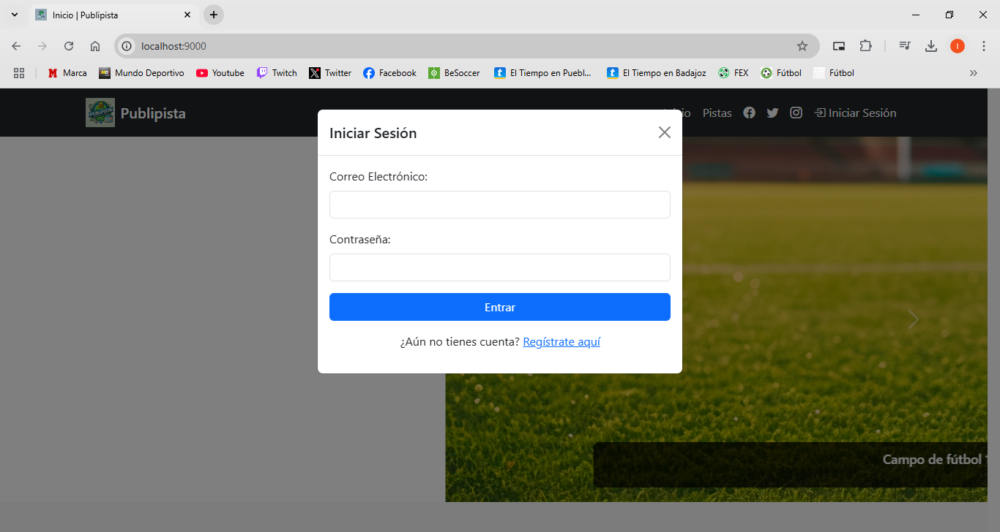

# Publipista, reservas de pistas deportivas

## Manual de usuario - Usuario básico

### Inicio

La primera vez que entres en la web, verás esta pantalla.

  
[Página de Inicio](./img/pag_inicio.gif)

Aquí la elección es fácil, si ya tienes una cuenta, sólo tienes que iniciar sesión. Si por el contrario, aún no te has registrado y no tienes credenciales de usuario, ¡no te preocupes!  
En la página principal en el menú de login encontrarás un botón que te permite acceder al registro de una cuenta.

  
[Inicio de sesión](./img/modal_inicio-sesion.PNG)

[Registro](./img/modal_registro.PNG)

### Información sobre las pistas sin necesidad de iniciar sesión

  
[Información sobre las pistas](./img/info_pistas.gif)

### Página para reservar las pistas

  
[Página de reservas](./img/pistas_reservar.gif)

### Reserva y página de mis reservas

[Reserva](./img/reserva.gif)

### Email automatizado con la confirmación de la reserva

[Confirmación de reserva](./img/confirmacion_reserva.PNG)

# Fin
